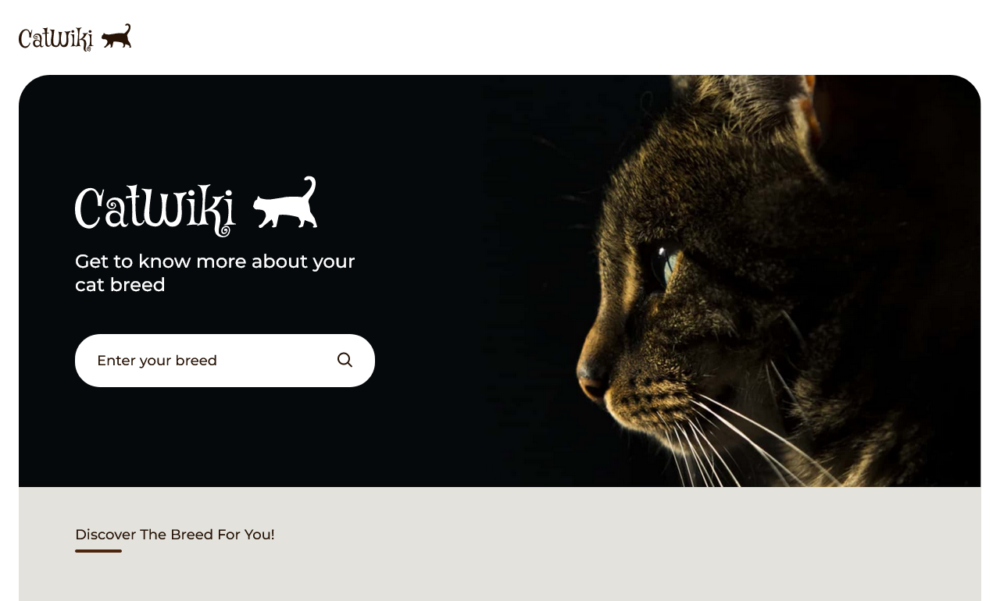

# CatWiki - Discover the right breed for you!

This is a solution to the following [devChallenges](https://devchallenges.io/challenges/f4NJ53rcfgrP6sBMD2jt).

## Table of contents

- [Overview](#overview)
  - [Features](#features)
  - [Screenshot](#screenshot)
  - [Links](#links)
  - [Built with](#built-with)
- [Author](#author)

## Overview

### Features

- Search for cat breeds
- See the most popular cat breeds summary on the homepage
- Page with the 10 most popular cat breeds
- Page with breed details including description, temperament, origin, life span, adaptability, affection level, child-friendly, grooming, intelligence, health issues, xsocial needs, stranger friendly
- Page with all breeds.

### Screenshot

### Links

- Repository URL: [Github repository](https://github.com/jmarellanes/catwiki-kitties-info)
- Live Site URL: [CatWiki - Discover the right breed for you!](https://catwiki.josearellanes.me/)

### Built with

- Semantic HTML5 markup
- Accessible features
- CSS Modules
- Sass
- React
- Axios
- React Query
- Serverless functions with Airtable as DB

## Author

- [Portfolio](http://www.josearellanes.me/)
- [Linkedin](https://www.linkedin.com/in/jmarellanes/)
- [Github](https://www.github.com/jmarellanes)
- [@jmarellanes](https://twitter.com/jmarellanes)
